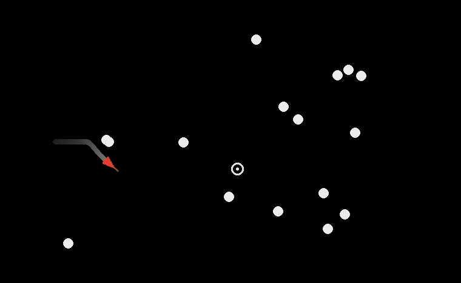

<a href="https://dy.github.io/jz/"></a>

 [](https://www.npmjs.com/package/jz) [](https://github.com/dy/jz/actions/workflows/test.yml) [](https://github.com/dy/jz/actions/workflows/bench.yml)

**JZ** (_javascript zero_) is a distilled JS subset that compiles to fast, minimal WASM.

| Good for | Not for |
|---|---|
| DSP, audio, synthesis | UI, DOM, frontend state |
| Images, video, pixels | Network, hot I/O, serving HTTP |
| Simulation, physics, games | Dynamic object models and monkey-patching |
| Parsers, codecs, compression | Allocation-heavy, long-lived object graphs |
| Scientific, numeric, edge ML | Security-sensitive cryptography and arbitrary-precision integers |
| Hashing, checksums, RNG | Tiny calls where the JS/WASM boundary dominates |


**[site](https://dy.github.io/jz/)**  /  **[try it](https://dy.github.io/jz/repl/)**  /  **[examples](https://dy.github.io/jz/examples/)**  /  **[benchmarks](https://dy.github.io/jz/bench/)**

<sup>Used by: [color-space](https://github.com/colorjs/color-space), [audiojs](https://github.com/audiojs/)</sup>

## Usage

```sh
npm install jz
```

```js
import { compile } from 'jz'

const wasm = compile('export const dist = (x, y) => (x*x + y*y) ** 0.5')
const { instance } = await WebAssembly.instantiate(wasm)

instance.exports.dist(3, 4) // 5
```

<details>
<summary><strong>Options</strong></summary><br>

Options are passed as `jz(source, opts)` or `compile(source, opts)`:

| Option | Use |
|---|---|
| `modules: { specifier: source }` | Static ES imports to bundle. CLI import resolution does this from files automatically. |
| `imports: { mod: host }` | Host imports `import { fn } from "mod"`. |
| `memory` | Pass `memory: N` for owned memory with `N` initial pages, or `memory: jz.memory()` / `WebAssembly.Memory` to share across modules. `maxMemory: N` caps growth; `importMemory: true` imports `env.memory` instead of exporting own. |
| `host: 'js' \| 'wasi' \| 'native'` | Runtime-service lowering. Default `js`; `wasi` for standalone runtimes; `native` targets the wasm2c/native lane (same module shape as `js`, tail calls off). |
| `optimize` | `false`/`0` off, `1` minimal, `true`/`2` default (all stable passes), `3`/`'speed'` trades size for speed, `'size'` for smallest wasm, `'fast'` for fastest compile (default passes, final wat optimizer off). (Object form for per-pass overrides is internal/unstable.) |
| `define` | Compile-time constants injected as top-level bindings, e.g. `{ DEBUG: false, PORT: 8080 }` (numbers, booleans, strings, null, or literal arrays/objects). |
| `strict: true` | Skip jzify lowering and reject dynamic fallbacks such as `obj[k]`, `for-in`, and unknown receiver methods. |
| `alloc: false` | Omit allocator exports (`_alloc`/`_clear`) from modules that never marshal heap values. |
| `noSimd: true` | Disable auto-vectorization. Explicit `f32x4` and `i32x4` intrinsics still compile. |
| `whyNotSimd: true` | Report the first operation that prevented each loop from being vectorized. Warnings go to the `warnings` sink. |
| `stencil` / `outerStrip` / `toneMap` | Structure vectorizers: neighbour-load stencils (`b[i] = f(a[i-1], a[i], a[i+1])`, 2-D 5-point), strip-mined pixel loops over an inner reduction, and log-tonemap islands — all to f64x2, bit-exact vs scalar. On by default at `optimize` 2+; pass `false` to disable one, `true` to force it at lower levels. |
| `noTailCall: true` | Use ordinary call frames instead of `return_call` for engines/tools without the tail-call proposal. |
| `noEhAbort: true` | Lower internal throws to `unreachable` in genuinely catch-free modules even when source has a bare `throw` — drops the exceptions tag for consumers with no wasm-EH (wasm2c, w2c2). |
| `sharedMemory: true` | Compile against an imported SHARED memory (wasm threads): atomic heap bump; link with `new WebAssembly.Memory({ initial, maximum, shared: true })`. |
| `nativeTimers: true` | Emit a blocking timer loop in `_start` so `setTimeout`/`setInterval` fire under standalone runtimes with no host event loop (e.g. the wasmtime CLI). |
| `warnings` | Mutable sink populated with `entries: [{ code, message, fn?, line?, column? }]` — heap-growth advisories, `simd-why-not` reports. |
| `randomSeed` | Set a number for a reproducible `Math.random` sequence. The default uses host entropy; `true` requests entropy explicitly. |
| `wat: true` | `compile()` returns WAT text instead of WASM binary. |
| `names: true` | Emit a WASM `name` section (function symbols) for profilers/debuggers. |
| `profile` | Mutable sink for compile-stage timings (`entries`/`totals` per phase). |
</details>

## CLI

`npm install -g jz`

```sh
jz program.js              # → program.wasm
jz program.js --wat        # → program.wat
jz program.js -o out.wasm  # custom output (- for stdout)
jz program.js -O3          # optimization: -O0 off, -O1 min, -O2 default, -O3 speed, -Os size
jz program.js --host wasi  # standalone WASI output
jz --strict program.js     # pure canonical subset (also implied by .jz extension)
jz -e "1 + 2"              # eval → 3
```

<details>
<summary><code>jz --help</code></summary>

```
jz. min JS → WASM compiler

Usage:
  jz <file.js>              Compile JS to WASM (full JS subset; .jz = strict)
  jz --strict <file.js>     Strict mode — pure canonical subset, no lowering
  jz --jzify <file.js>      Transform JS → jz source (auto-derives output file)
  jz -e <expression>        Evaluate expression
  jz --help, -h             Show this help

Examples:
  jz program.js                    # → program.wasm
  jz program.js --wat              # → program.wat
  jz program.js -o out.wasm        # custom output name
  jz program.js -o -               # write to stdout
  jz program.js -O3                # optimize for speed
  jz program.js -Os                # optimize for size
  jz program.js -D DEBUG=false     # inject a compile-time constant
  jz program.js --memory 64        # 64 initial pages (4 MB)
  jz program.js --host wasi        # emit WASI Preview 1 imports
  jz --strict program.js           # strict mode
  jz --jzify lib.js                # → lib.jz
  jz -e "1 + 2"

Options:
  --output, -o <file>       Output file (.wat, .wasm, or - for stdout)
  -O<n>, --optimize <n>     Optimization level: 0 off, 1 minimal, 2 default (all
                            stable passes), 3 speed. -Os optimizes for size,
                            -Ofast compiles fastest (default passes, wat optimizer off).
  --define, -D <K=V>        Inject a compile-time constant (VALUE parsed as JSON,
                            else string). Repeatable.
  --host <js|wasi|native>   Runtime-service lowering (default js). 'native' targets
                            the wasm2c/native-lowering lane (scripts/native/) —
                            same module shape as 'js', tail calls off (wasm2c
                            return_call + multi-value codegen bug)
  --memory <pages>          Initial memory size in 64 KiB pages
  --max-memory <pages>      Cap memory growth at this many pages (default unbounded)
  --import-memory           Import env.memory instead of exporting own memory
  --no-alloc                Omit _alloc/_clear allocator exports (standalone wasm)
  --no-simd                 Disable auto-vectorization (no v128) for non-SIMD engines
  --why-not-simd            Report, per loop, why the auto-vectorizer declined it
  --stencil                 Force neighbour-load stencil vectorization (a[i±1]) at
                            levels where it's off (on by default at -O2+)
  --outer-strip             Force pixel-loop strip-mining over an inner reduction to
                            f64x2 at levels where it's off (on by default at -O2+)
  --no-tail-call            Use ordinary call frames instead of return_call
  --no-eh-abort             Lower internal throws to unreachable even with a bare throw
                            in source (no wasm-exceptions tag), when no try/catch is reachable
  --names                   Emit wasm name section for profilers/debuggers
  --stats                   Print compile-phase timings to stderr
  --strict                  Pure canonical subset: reject full-JS syntax + dynamic fallbacks
  --jzify                   Transform JS to jz source (no compilation)
  --eval, -e                Evaluate expression or file
  --wat                     Output WAT text instead of binary
  --resolve                 Resolve bare specifiers via Node.js module resolution
  --imports <file>          JSON file with host import specs (e.g. {"env":{"fn":{"params":2}}})
  --version, -v             Show version number
```
</details>


## Examples

<table>
<tr>
<td width="33%"><a href="https://dy.github.io/jz/examples/chladni/"></a><br><b>chladni</b></td>
<td width="33%"><a href="https://dy.github.io/jz/examples/dwa/"></a><br><b>robot motion</b></td>
<td width="33%"><a href="https://dy.github.io/jz/examples/hydrogen/"></a><br><b>hydrogen</b></td>
</tr>
</table>

See [all examples](https://dy.github.io/jz/examples/).

## FAQ

<details>
<summary><strong>What JS is supported?</strong></summary>

```txt
┌────────────────────────────────────────────────────────────────────────┐
│ ┌────────────────────────────────────────────────────────────────────┐ │
│ │ jz strict                                                          │ │
│ │   let/const  arrows  rest  destructuring  import/export            │ │
│ │   if/else  for/while/do-while/of  break/continue                   │ │
│ │   try/catch/finally  throw                                         │ │
│ │   numbers  strings  booleans  arrays  objects  template literals   │ │
│ │   Math  Number  String  Array  Object  JSON  RegExp  Symbol        │ │
│ │   ArrayBuffer  DataView  typed arrays  Map  Set  Atomics           │ │
│ │   Float16Array  base64/hex codecs  TextEncoder  timers  Date       │ │
│ │   crypto randomness  URLSearchParams  structuredClone  Set algebra │ │
│ │   WASI file I/O                                                    │ │
│ └────────────────────────────────────────────────────────────────────┘ │
│ jz default (jzify)                                                     │
│   var  function  arguments  switch                                     │
│   class  new  this  extends  super  private/static fields              │
│   generators  iterator helpers  async/await  Promise  for await        │
│   loose equality  instanceof  WeakMap  WeakSet                         │
└────────────────────────────────────────────────────────────────────────┘

not supported
  eval  Function  with  Proxy  Reflect
  property descriptors  getters/setters  live prototypes
  dynamic import  DOM  Intl  Temporal  Node APIs
```

</details>

<details>
<summary><strong>What differs from JS?</strong></summary>

- **Numbers.** Numbers are `f64`. Proven integers use `i32` and wrap at ±2³¹.
  Applying `x | 0` to an f64 with |x| ≥ 2⁶³ saturates instead of ES-wrapping.
- **BigInt.** BigInt is a signed 64-bit integer, not arbitrary precision; it
  wraps past its range. Security cryptography is outside the scope.
- **Math.** Basic operations are IEEE-exact. Transcendentals use JZ's own kernels
  and may differ from the host library in their last bits. `Math.sumPrecise`
  accumulates exactly and rounds once.
- **Strings.** Strings are UTF-8 bytes, not UTF-16. Length, indexing, slicing,
  search, and regular-expression positions count bytes. Case conversion is
  ASCII-only; Unicode property classes, normalization, and locale tables are
  unsupported.
- **Objects.** Literal fields have fixed slots; computed keys use hash storage.
  Live prototype chains, property descriptors, accessors, Proxy, and Reflect
  do not exist: `__proto__`, delegation, and monkey-patching are unsupported,
  `Object.create(proto)` makes a shallow copy, method dispatch is static, and
  traps cannot attach to compile-time struct offsets. Literal shapes are
  fixed, so `delete o[k]` works only in dictionary mode.
- **Dynamic keys.** Runtime boolean keys use their numeric carrier, so `o[b]`
  reads `'1'` for `true`. Static boolean keys fold correctly.
- **Array indices.** Indices coerce to `i32`. Plain arrays are bounds checked;
  typed arrays use raw fixed-size linear-memory access, so invalid indices can
  read unrelated memory or trap.
- **Memory.** There is no garbage collector. Call `memory.reset()` between
  independent allocation batches; it invalidates every previous pointer.
  WeakRef and FinalizationRegistry have nothing to observe; `WeakMap` and
  `WeakSet` use `Map` and `Set` semantics.
- **Generators and async.** Both lower to state machines. Jobs drain at host
  boundaries; `try` across `yield` or `await` is unsupported.
- **Dates.** Date getters use UTC. Intl and Temporal are absent: ICU, CLDR,
  and timezone tables exceed the intended module size.
- **Runtime compilation.** `eval`, the `Function` constructor, and `with` would
  require a compiler or interpreter at runtime.
- **Host and legacy APIs.** DOM and Node services stay in the host. JZ omits
  the additional legacy syntax of [ECMAScript Annex B](https://tc39.es/ecma262/multipage/additional-ecmascript-features-for-web-browsers.html).

</details>

<details>
<summary><strong>Why no types?</strong></summary>

Ordinary code already carries useful type evidence: `let x = 0.5`,
`Float32Array`, an array index, a loop counter. JZ infers it instead of
turning the file into another language. Ambiguous values take a slower,
always-correct dynamic path.

</details>

<details>
<summary><strong>Can I use npm packages and ES modules?</strong></summary>

Packages compile when their source fits the JZ language. Pure numeric or
algorithmic source may include async functions and promises; code using the
DOM or Node APIs does not; those services cross as host imports.

Standard `import`/`export` syntax bundles into one WASM module at compile
time; there is no runtime module resolution.

- Relative imports (`./dep.js`) bundle from the filesystem via the CLI. In a
  browser, fetch the sources and pass them through `{ modules }`.
- Bare package specifiers (`import { x } from "pkg"`) require the CLI's
  `--resolve` flag or source supplied through `{ modules }`.
- Transitive imports work; circular imports fail at compile time.

```js
const { exports } = jz(
  'import { add } from "./math.js"; export const f = (a, b) => add(a, b)',
  { modules: { './math.js': 'export const add = (a, b) => a + b' } }
)
```

</details>

<details>
<summary><strong>Can I call into the host (functions, objects)?</strong></summary>

Import from a named module in the compiled source, then provide that module
through `{ imports }`: a JavaScript function, constant, or whole namespace.
Functions become WASM imports; numeric constants fold. Numbers pass directly;
strings, arrays, and objects cross through `memory.*`.

```js
// custom function
jz(
  'import { log } from "host"; export const f = x => { log(x); return x }',
  { imports: { host: { log: console.log } } }
)

// whole namespace
jz(
  'import { sin, PI } from "math"; export const f = () => sin(PI / 2)',
  { imports: { math: Math } }
)

// globalThis works too
jz(
  'import { parseInt } from "window"; export const f = () => parseInt("42")',
  { imports: { window: globalThis } }
)
```
</details>

<details>
<summary><strong>Can I interpolate values (template literals)?</strong></summary>

As a tagged template, `jz` inserts interpolated values at compile time. Numbers and booleans inline directly; strings, arrays, and objects become JZ literals:

```js
jz`export let f = () => ${'hello'}.length`               // 5
jz`export let f = () => ${[10, 20, 30]}[1]`              // 20
jz`export let f = () => ${{name: 'jz', count: 3}}.count` // 3

const scale = (x) => x * 10
jz`export let f = (n) => ${scale}(n) + 1`                // f(2) → 21, host-called
```

Interpolated functions become host calls. Non-serializable values such as host objects and class instances use post-instantiation getters.

</details>

<details>
<summary><strong>How do I pass numbers, strings, arrays, and objects between JS and WASM?</strong></summary>

Numbers cross as `f64` or `i32`. Heap values use tagged pointers; `null`,
`undefined`, and booleans use atom tags. Both use the same i64 NaN-box carrier,
represented as `BigInt` in JavaScript; i64 preserves the NaN payload in JSC and
Safari, which canonicalize f64 NaNs at the boundary. The carrier and the
`_alloc`/`_clear` exports form the ABI, documented in [`layout.js`](layout.js)
and [`test/abi.js`](test/abi.js); the [`jz:i64exp`](interop.js) custom section
marks i64 parameters and results.

The wrapped `exports` returned by `jz()` or `jz/interop`'s `instantiate()`
marshal arguments, decode results, and convert WASM throws to `Error` objects:

```js
const { exports } = jz`
  export const greet = s => s.length
  export const dist = p => (p.x * p.x + p.y * p.y) ** 0.5
  export const point = (x, y) => ({ x, y })
  export const rgb = c => [c, c * 0.5, c * 0.2]
  export const sum = a => { let n = 0; for (const x of a) n += x; return n }
`

exports.greet('hello')                   // 5
exports.dist({ x: 3, y: 4 })             // 5
exports.point(3, 4)                      // { x: 3, y: 4 }
exports.rgb(100)                         // [100, 50, 20]
exports.sum(new Float64Array([1, 2, 3])) // 6
```

For raw `instance.exports` calls, `memory.String`, `.Array`, typed-array
methods, and `.Object` allocate on the WASM heap and return a pointer;
`memory.read(ptr)` decodes a raw result. Keys passed to `memory.Object()` must
match a compiled schema; key order does not matter. Numeric arrays of at most
eight elements return as WASM multi-values.

</details>

<details>
<summary><strong>What ships at runtime, and where does it run?</strong></summary>

The compiler runs at build time or synchronously in a browser/Worker. The
resulting module runs in browsers, Workers, Node, Deno, Bun, and standalone
WASM engines.

- **Heap-free numeric modules** ship as ordinary `.wasm` with no JZ runtime,
  memory, allocator, GC, or bundled JavaScript engine.
- **Heap values** use the optional `jz/interop` bridge, about 6 KB gzipped, for
  memory codecs, errors, WASI, and host imports.
- **`host: 'js'`** binds services such as time and console through `env.*`.
- **`host: 'wasi'`** emits WASI Preview 1 imports for standalone engines. When
  manually instantiating a reactor, call `instance.exports._initialize?.()` once.

A module imports `env`, `wasi_snapshot_preview1`, or neither, according to what
the source actually uses.

</details>

<details>
<summary><strong>How does memory work?</strong></summary>

Heap-using modules use a growing bump allocator with no free list or garbage
collector. Allocations are discarded in batches:

```js
for (let i = 0; i < 1000; i++) {
  const result = exports.process(100) // allocates on the WASM heap
  memory.reset()                      // drop the whole batch
}
```

`memory.reset()` invalidates every previous pointer. Scalar modules without heap
values omit the allocator.

For threads, `sharedMemory: true` compiles against shared `WebAssembly.Memory`,
with `Atomics.*` lowering to WASM thread operations; `jz.pool(src, { threads })`
runs one kernel across worker threads. Shared typed arrays and scalars cross;
strings and objects stay thread-local.

`jz.memory()` creates memory shared by multiple compiled modules. Schemas
accumulate, so one module can consume an object created by another:

```js
const memory = jz.memory()
const a = jz('export const make = () => ({ x: 10, y: 20 })', { memory })
const b = jz('export const read = o => o.x + o.y', { memory })

b.exports.read(a.exports.make()) // 30
```

Pass an existing `WebAssembly.Memory` to `jz.memory(memory)` to wrap it.

</details>

<details>
<summary><strong>Is it fast?</strong></summary>

JZ leads V8 and AssemblyScript by geometric mean on the covered corpus and
targets near-native speed. The release gate is stricter than an average: JZ
must be the fastest WASM on every case. Per-case numbers, missing target
coverage, and every measured loss stay visible on the
[bench page](https://dy.github.io/jz/bench/); a rival win is a bug to close,
not an exception to hide.

</details>

<details>
<summary><strong>How small is the output?</strong></summary>

A heap-free numeric program emits no memory, allocator, or startup function; an
empty program emits an empty module. Runtime helpers and standard-library kernels
are included only when reachable.

In the published benchmark corpus, size-optimized JZ modules are 1.02× the size
of AssemblyScript modules by geometric mean. AssemblyScript's ports use unchecked
array access while JZ retains JavaScript out-of-bounds guards. Most JZ modules in
the corpus are single-digit kilobytes.

- `optimize: 'size'` disables unrolling and SIMD.
- `alloc: false` omits allocator exports from numeric modules.
- Function names are omitted unless `names: true` is set.

The compiler stays in the build step; these sizes are what ships.

</details>

<details>
<summary><strong>Which optimizations are applied?</strong></summary>

At the default `optimize: 2`, JZ applies:

- Type and representation inference from syntax and use sites for parameters,
  results, objects, and arrays. Ambiguous values remain dynamic.
- Direct typed-array memory access with proven bounds and aliases.
- Escape analysis and arena rewind for short-lived aggregates.
- Constant folding, common-subexpression and dead-store elimination, inlining,
  invariant hoisting, induction reduction, and loop unrolling.
- SIMD-128 vectorization of independent maps, reductions, conditionals, and byte
  scans. Loop-carried dependencies remain scalar.
- Tree shaking and reachability-gated runtime helpers.

`optimize: 3` / `'speed'` accepts additional code size for throughput;
`optimize: 'size'` disables unrolling and SIMD.

</details>

<details>
<summary><strong>How do I inspect or debug output?</strong></summary>

- Run the same source under Node and compare results, allowing for the documented
  differences above.
- `jz program.js --wat` or `compile(src, { wat: true })` prints WAT.
- Search WAT for `v128` to confirm vectorization and for `__dyn_get` or
  `__ext_call` to find dynamic fallbacks.
- `--why-not-simd` reports the first operation blocking each loop.
- `--strict` turns dynamic property and method fallbacks into compile errors.
- `--names` emits symbols; `--stats` prints compile-stage timings.

Float loop counters, plain arrays, and loop-carried dependencies are common
reasons a kernel remains slower or scalar.

</details>

<details>
<summary><strong>How does JZ compare with Porffor, AssemblyScript, scriptc etc.?</strong></summary>

- **[Porffor](https://github.com/CanadaHonk/porffor)** pursues full spec coverage with an engine-replacement design – interpreter-class speed, tiny binaries. JZ inverts the tradeoff: near-native speed on a typed subset. Porffor compiles JS to C/native first with WASM as a secondary target; JZ emits WASM first and lowers it to native C.
- **[scriptc](https://github.com/vercel-labs/scriptc)** also AOT-compiles typed JS/TS without an engine (TS annotations → LLVM), embedding QuickJS only as an opt-in fallback for dynamic code. It is native-first with WASI as a target; JZ is WASM-first, infers types from idiomatic untyped JS, and keeps dynamic fallbacks inside the WASM module.
- **[AssemblyScript](https://github.com/AssemblyScript/assemblyscript)** produces lean WASM, but is not directly executable JavaScript.
- **Rust, C, Zig, Go, and MoonBit** offer explicit static types and mature native
  toolchains, but require a second implementation when the source of truth is JS.
- **[Javy](https://github.com/bytecodealliance/javy)** and
  **[ComponentizeJS](https://github.com/bytecodealliance/ComponentizeJS)** accept
  broader JavaScript by shipping an interpreter or engine inside WASM.

</details>

<details>
<summary><strong>Can JZ compile itself?</strong></summary>

Yes. `npm run test:self` compiles JZ's parser, jzify pass, compiler, optimizer,
and encoder into `dist/jz.wasm`. That WASM-hosted compiler then compiles real
programs, whose output is instantiated and checked against the native compiler.

`dist/jz.wasm` is a self-host test artifact, not a runtime shipped with compiled
programs.

</details>

<details>
<summary><strong>Can JZ compile to native?</strong></summary>

JZ emits WASM, which [`wasm2c`](https://github.com/WebAssembly/wabt/tree/main/wasm2c) or w2c2 can translate to C and a C compiler can turn into a native executable:

```txt
JS → JZ → WASM → wasm2c → C → clang → native
```

`--host native` targets this lane directly (same module shape as `js`, tail
calls off for wasm2c). The native benchmark lane lowers with `wasm2c`, removes
its C optimizer barriers, hoists the guard-page-backed memory base, and builds
with native CPU tuning plus LTO. It does not require `wasm-opt`. A host harness
and wasm2c runtime must be linked, so this is currently a toolchain rather than
a one-command JZ target. See the [native pipeline](scripts/native/README.md).

</details>

<details>
<summary><strong>Is JZ production-ready?</strong></summary>

JZ is experimental and pre-1.0. The supported language and WASM ABI may change;
pin a version and re-test upgrades. CI runs the core suite, selected test262
language and built-in tests, benchmark checks, and a self-host build.

Adoption is ejectable: remove the JZ build step and the source remains JavaScript.

</details>

<p align="center">
  <a href="LICENSE">MIT</a>, <a href="https://github.com/krishnized/license/">ॐ</a>
</p>
