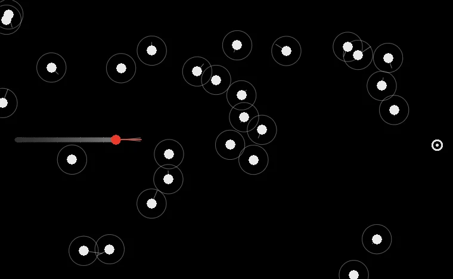

<a href="https://jz.js.org/"></a>

 [](https://www.npmjs.com/package/jz) [](https://github.com/dy/jz/actions/workflows/test.yml) [](https://github.com/dy/jz/actions/workflows/bench.yml)

**JZ** (_javascript zero_) compiles JavaScript to fast, minimal WASM.

**[site](https://jz.js.org/)**  /  **[guide](https://jz.js.org/guide/)**  /  **[try it](https://jz.js.org/repl/)**  /  **[examples](https://jz.js.org/examples/)**  /  **[benchmarks](https://jz.js.org/bench/)**

| Good for | Not for |
|---|---|
| DSP, audio, synthesis | UI, DOM, frontend state |
| Images, video, pixels | Network, hot I/O, serving HTTP |
| Simulation, physics, games | Dynamic object models and monkey-patching |
| Parsers, codecs, compression | Allocation-heavy, long-lived object graphs |
| Scientific, numeric, edge ML | Security-sensitive cryptography and arbitrary-precision integers |
| Hashing, checksums, RNG | Tiny calls where the JS/WASM boundary dominates |


<sup>Used by: [color-space](https://github.com/colorjs/color-space), [audiojs](https://github.com/audiojs/)</sup>

## Usage

```sh
npm install jz
```

```js
import { compile } from 'jz'

const wasm = compile('export const dist = (x, y) => (x*x + y*y) ** 0.5')
const { instance } = await WebAssembly.instantiate(wasm)

instance.exports.dist(3, 4) // 5
```

A numeric module like this one needs no runtime. For strings, arrays and
objects use `jz()` (compile and instantiate in one step) or `jz/interop`
(instantiate prebuilt wasm); both marshal values across the boundary:

```js
import jz from 'jz'

const { exports, memory } = jz`
  export const sum = a => { let n = 0; for (const x of a) n += x; return n }
`
exports.sum(new Float64Array([1, 2, 3])) // 6
memory.used                               // 0: the call kept nothing it allocated
```

<details>
<summary><strong>Options</strong></summary><br>

`jz(source, opts)`, `compile(source, opts)` and `instantiate(wasm, opts)` share one option set:

| Option | Use |
|---|---|
| `modules` | Sources for static imports, `{ './dep.js': source }`. The CLI reads them from disk. |
| `imports` | Host modules for `import { fn } from "mod"`: functions, constants, or a whole namespace such as `Math`. |
| `define` | Compile-time constants injected as bindings, `{ DEBUG: false, N: 1024 }`. Accepts numbers, booleans, strings, null/undefined, arrays and plain data objects. |
| `host` | `'js'` (default), `'wasi'` for standalone runtimes, `'native'` for the wasm2c lane. |
| `memory` | Initial pages, a `WebAssembly.Memory` or `jz.memory()` shared between modules, or `{ initial, maximum, shared, import, fixed }`. `fixed: ['process']` requires named Wasm exports to use fixed storage. |
| `optimize` | `true` (default), `'speed'`, `'size'`, `false`, or an object: `{ level, simd, tailCall, exceptions, alloc }` for engines without SIMD or tail calls and for raw standalone modules. |
| `randomSeed` | Number for a reproducible `Math.random`. |
| `names` | Emit the wasm name section for profilers and debuggers. |
| `sourceMap` | Debug build with statement locations and function names, through the JavaScript API or CLI. `true` embeds the map; `{ source, url }` names the entry and an external map URL. The returned bytes also expose `.sourceMap`. Selects `optimize: false`; optimized maps and maps from the Wasm-hosted compiler are not supported. |
| `wat` | Return WAT text instead of bytes. |
| `warnings` | Sink `{ entries }` or callback for advisories: dynamic fallbacks, heap growth. |
| `why` | Also report each loop the vectorizer and each arena the rewind declined; a `warnings` sink alone reports each property read left dynamic, each class kept as closures and the first cause an object shape is lost by. |
</details>

## Strict compiler

`jz/strict` exports `compile` (also the default export). It accepts the canonical
subset: `let`/`const`, arrow functions and structured control flow. It rejects
`var`, function declarations, classes, `switch` and unresolved dynamic fallbacks.
Use `jz/interop` to instantiate its output.

```js
import compile from 'jz/strict'
import { instantiate } from 'jz/interop'

const wasm = compile('export const square = x => x * x')
const { exports } = instantiate(wasm)
exports.square(7) // 49
```

It shares the main compiler's options, diagnostics and optimization pipeline.
The standalone `dist/strict.js` excludes the JavaScript lowering layer and host
runtime. Its current bundle is about 2.65 MiB minified / 758 KiB gzip.

## CLI

```sh
npm install -g jz

jz kernel.js                # → kernel.wasm
jz kernel.js --wat          # → kernel.wat
jz kernel.js -o out.wasm    # custom output, - for stdout
jz kernel.js -O3            # fastest code; -Os smallest; -O0 none
jz kernel.js --host wasi    # standalone WASI module
jz kernel.js --why          # what the optimizer declined, and why
jz kernel.js --source-map   # debug build + kernel.wasm.map, with source content
```

`jz --help` lists the rest: `-D`, `--memory`, `--no-simd`, `--no-tail-call`, `--names`, and `-O '{…}'` for the optimize object.

## Examples

<table>
<tr>
<td width="33%"><a href="https://jz.js.org/examples/chladni/"></a><br><b>chladni</b></td>
<td width="33%"><a href="https://jz.js.org/examples/dwa/"></a><br><b>robot motion</b></td>
<td width="33%"><a href="https://jz.js.org/examples/hydrogen/"></a><br><b>hydrogen</b></td>
</tr>
</table>

See [all examples](https://jz.js.org/examples/).

## FAQ

<details>
<summary><strong>What is not supported?</strong></summary>

- **Runtime code:** `eval`, `Function`, `with`.
- **Reflection:** `Proxy`, `Reflect`, property descriptors, prototype chains and `__proto__`.
- **Object accessors:** getters/setters need a fixed property layout; mixing them with runtime-computed keys or a spread of unknown keys is unsupported.
- **Module dynamics:** top-level `await` other than `await import('./x.js')`, and `import()` of a specifier computed at run time. A literal `import('./x.js')` bundles `x.js`, which evaluates at the first `import()` unless a static import loaded it.
- **Platform:** DOM, Node modules, `Intl`, `Temporal`.
- **Builtins as values:** `f(Math)`, `[Map]`, `xs.map(parseInt)`. `typeof Math` answers; members (`xs.map(Math.sqrt)`), `Number`, `Boolean` and the typed-array constructors are values.

Modern JavaScript is supported: classes, generators, async/await, destructuring,
BigInt, typed arrays, Map/Set, RegExp, Date, JSON, timers and the Web codecs.

Where behaviour differs from JS:

- **No GC.** A call releases what it allocated on return, except what it stored into something older than itself and what lies below that in the heap; what a call keeps lives until `memory.reset()`, and what it replaces is not freed. `WeakMap`, `WeakSet` and `WeakRef` hold strongly.
- **In-place array arguments.** An exported function that stores into an array argument and reads it back takes a Float64Array, a Float32Array or an Array there, which round as JS rounds them; another kind throws a TypeError.
- **Float sums in lanes.** From optimize level 2, a loop that sums floats may add in two lanes: the last digits of the sum can differ.
- **Bitwise operands under 2^63.** `|`, `&`, `^`, `~`, the shifts and `Math.imul` convert an operand of magnitude under 2^63 as JS does. A larger one reads as -1, or as 0 when negative, where JS takes it modulo 2^32: `1e300 | 0` is -1. A store to an integer typed array converts exactly at any magnitude.
- **Math within 50 ulp of V8.** Measured against V8's results: `sin`, `cos`, `tan` up to 49 ulp, `asin`, `acos` 38, `atan`, `atan2` 10, exponentials, logarithms, hyperbolics and `hypot` 5, `pow` 11, a constant `** 2.4`-style exponent 40; `sqrt` and `cbrt` agree. A test comparing them bit for bit needs a tolerance. `x ** 0.5` is `Math.sqrt(x)`, so `(-Infinity) ** 0.5` is NaN.
- **BigInt is 64-bit.** It wraps past its range and has no `**`. `BigInt64Array` and `BigUint64Array` share one representation: a value of either passes `instanceof` for both, and `.constructor` of either reads undefined.
- **No holes.** `[1, , 3]` and a write past the end fill the gap with `undefined` elements: `1 in a`, `Object.keys` and `forEach` see them.
- **32-bit element indices.** An array holds up to 2³¹−1 elements. A store under a number that is not an index (`a[1.5] = v`, `a[-1] = v`) is dropped, where JavaScript gives the array a named property.
- **Regexes compile at build time.** `new RegExp(pattern)` needs a literal; `\p{…}`, `d` and `v` flags are unsupported.
- **ASCII case, UTC dates.** No locale or timezone tables: case conversion is ASCII, `normalize` returns its input, Date getters use UTC.
- **Fixed shapes.** Object fields are slots resolved at compile time; `Object.freeze` does nothing and errors carry `name` and `message` only.
- **Class methods stay bound.** An extracted class method retains its instance. Object-literal methods use the call receiver.
- **Numeric export parameters.** A parameter an exported function never uses as a string is compiled as a number and converted at the boundary: `export let add = (a, b) => a + b` gives `add(1, '2')` as 3, where JavaScript concatenates. A use as a string counts through a copy, a call and a sum: `(s) => (s + s).slice(1)` takes a string.

</details>

<details>
<summary><strong>Why no type annotations?</strong></summary>

Ordinary code already carries useful type evidence: `let x = 0.5`,
`Float32Array`, an array index, a loop counter. JZ infers it instead of
turning the file into another language. Ambiguous values fall back to a
slower dynamic path, and `why` shows where.

</details>

<details>
<summary><strong>How do values cross the boundary?</strong></summary>

Numbers pass directly. Strings, arrays and typed arrays are copied in and
decoded on the way out; numeric writes to an array argument are copied back
after the call at the length the function left it, its non-numeric elements are
not. A
typed array keeps its element kind: a Float32Array block runs as one. The copies
are released after the call unless the function keeps them. A plain object
passes by reference: the module reads, writes, lists and serializes it through
the host, so the caller sees its changes; a typed array the module stores on it
is a view of the module's memory, read back as the same array (the host's view
detaches if the memory grows). A JZ buffer (`memory.Float64Array(n)`,
`memory.Float32Array(n)`) is the storage itself, so hand hot loops one of those
instead of copying per call. A function the module returns, or stores on a host
object, reaches the host as a function that calls back into it.

```js
const { exports } = jz`
  export const greet = s => s.length
  export const point = (x, y) => ({ x, y })
  export const rgb = c => [c, c * 0.5, c * 0.2]
  export const counter = () => { let n = 0; return { next: () => ++n } }
`
exports.greet('hello')   // 5
exports.point(3, 4)      // { x: 3, y: 4 }
exports.rgb(100)         // [100, 50, 20]
const c = exports.counter()
c.next(); c.next()       // 2
```

Host functions come in through `imports`; a tagged template inlines values and
functions at compile time:

```js
jz('import { log } from "host"; export const f = x => { log(x); return x }',
   { imports: { host: { log: console.log } } })

jz('import { sin, PI } from "math"; export const f = () => sin(PI / 2)',
   { imports: { math: Math } })

const scale = x => x * 10
jz`export const f = n => ${scale}(n) + ${[10, 20, 30]}[1]`   // f(2) → 40
```

Ship the `.wasm` and load it with `instantiate` from `jz/interop`, a 13 KB
gzipped runtime that marshals values and decodes errors; the compiler stays in
the build.

</details>

<details>
<summary><strong>How does memory work?</strong></summary>

Heap modules use a bump allocator: no free list, no garbage collector. A call
gives back what it allocated when it returns, unless it wrote a value it made
into something older than itself: a module binding, state an earlier call
made, an argument. Whatever the call built and dropped goes, closures,
objects and growing buffers included, and the copies of its arguments with
it; a loop whose iterations keep nothing does the same per iteration. A value
the call returns is the caller's: the host takes a copy of a string, an
array, an object or a collection, and the call's memory goes; a typed array
is a view of the module's memory, and a call that returns one it made keeps
what it allocated (`heap-return` in the `warnings` sink). A call that does keep a value keeps what the value reaches
and whatever it allocated before it: the heap goes back to the end of the
highest block kept, so state made first and temporaries after it cost the
state alone (at `optimize: 'size'` such a call keeps all it allocated).
State replaced on every call (`buf = new Float64Array(n)` each block) costs
an array a call, and the arrays it replaced are never freed. Keep such state
in storage made once and written in place. What a call keeps stays until `memory.reset()`, which
returns the module to its state after instantiation and invalidates every
earlier pointer: a binding, an array, a collection and an object the module
made as it started read as they started (an object's field that holds a number
keeps it). `memory.used` reads the bytes held, so a host can see a call
that keeps memory; the `warnings` sink names each export that keeps memory on
every call and why at compile time (`heap-per-call`).

```js
for (let i = 0; i < 1000; i++) {
  exports.process(100)   // allocates on the WASM heap and keeps some
  memory.reset()         // drop the batch
}
```

Memory that cannot grow, past `memory: { maximum }`, the 4 GiB of wasm32 or
the engine's limit, throws the RangeError of an allocation, which the program
can catch; after a `memory.reset()` the module runs again.

For DSP, `memory: { fixed: ['process'] }` checks the final Wasm call graph:
the selected exports and their typed variants must run without heap allocation,
memory growth, host calls, recursion or reachability tracing. Initialization
can allocate persistent state. An export whose memory behavior cannot be proved
is a compile error with the failing call path.

```js
const { instance, memory } = jz(`
  export function process(a) {
    const tmp = new Float32Array(128)
    for (let i = 0; i < 128; i++) tmp[i] = a[i] * 0.5
    for (let i = 0; i < 128; i++) a[i] = tmp[127 - i]
  }
`, { memory: { fixed: ['process'] } })

const input = memory.Float64Array(new Float64Array(128)) // prepare once
instance.exports.process(input) // borrowed storage through the raw Wasm ABI
```

The compiler places eligible local typed arrays in the selected functions and
their named helpers in reusable scratch storage,
clears them at each construction, and shares equal-layout slots across disjoint
lifetimes. It currently handles constant sizes up to 64 KiB per array with
numeric indexed accesses and length reads; escaping buffers retain their normal
allocation and cannot pass the fixed-memory check. Storage belongs to one
instance, so imported and shared memories are rejected.

Fixed mode disables `arenaReach` for the module. General mode can use that
runtime walk to find how far an escaping call's heap can rewind. The fixed
guarantee covers Wasm execution, excluding JS argument/result marshalling and
OS scheduling; it is not an audio-deadline guarantee. Prepare buffers before
processing and use the matching raw exports when the host must avoid marshalling.

`jz.memory()` creates one memory for several modules, so one can read what
another allocated:

```js
const memory = jz.memory()
const a = jz('export const make = () => ({ x: 10, y: 20 })', { memory })
const b = jz('export const read = o => o.x + o.y', { memory })

b.exports.read(a.exports.make()) // 30
```

`memory: { shared: true }` compiles for threads, with `Atomics` lowering to
wasm atomics. Shared typed arrays and scalars cross; strings and objects stay
thread-local.

</details>

<details>
<summary><strong>Can I use npm packages and ES modules?</strong></summary>

Packages compile when their source fits the language. `import`/`export` bundle
into one module at compile time; there is no runtime module resolution. The CLI
reads relative and bare specifiers from disk; in a browser, pass sources through
`modules`. Circular imports fail at compile time.

```js
jz('import { add } from "./math.js"; export const f = (a, b) => add(a, b)',
   { modules: { './math.js': 'export const add = (a, b) => a + b' } })
```

</details>

<details>
<summary><strong>Is it fast? How small?</strong></summary>

Faster than V8 and AssemblyScript on almost every kernel we measure, about 2×
on average. Every number, and every loss, is on the
[bench page](https://jz.js.org/bench/).

Nothing ships that the program does not reach: a heap-free numeric module has
no memory, allocator or startup, and an empty program is an empty module.
Size-optimized JZ stays within 5% of AssemblyScript's geomean while keeping
JavaScript's bounds checks.

</details>

<details>
<summary><strong>How do I inspect or debug the output?</strong></summary>

- A rejected program names the construct that faulted: its module (when there
  are several), line and column, and the source line.
- `jz kernel.js --wat` or `compile(src, { wat: true })` prints the WAT. Search
  for `v128` to confirm vectorization and for `__dyn_get` or `__ext_call` to find
  dynamic fallbacks.
- `--why` names the first operation that kept each loop scalar, each arena
  unreclaimed and each fixed-count array's checks in place (`array-open`);
  `warnings` collects the same advisories from the API, with each
  property read left dynamic (`deopt-prop-read`), each class kept as closures
  (`class-generic`) and the first cause an object shape is lost by (`shape-lost`).
- Float loop counters, plain arrays and loop-carried dependencies are the common
  reasons a kernel stays scalar.

</details>

<details>
<summary><strong>How does JZ compare with Porffor, AssemblyScript, scriptc etc.?</strong></summary>

- **[Porffor](https://github.com/CanadaHonk/porffor)** targets broad engine
  coverage with an AOT JS→IR→C/native compiler; its current alpha line has no
  WASM target. JZ emits WASM first for an inferred typed subset. JZ may not lose
  to Porffor's native artifact on speed or size per case or by geomean.
- **[scriptc](https://github.com/vercel-labs/scriptc)** also AOT-compiles typed JS/TS without an engine (TS annotations → LLVM), embedding QuickJS only as an opt-in fallback for dynamic code. It is native-first with WASI as a target; JZ is WASM-first, infers types from idiomatic untyped JS, and keeps dynamic fallbacks inside the WASM module.
- **[Perry](https://perryts.com/)** compiles JS/TS through LLVM to native executables with a linked runtime and garbage collector. Our [benchmarks](bench/README.md) cover its native output on the unchanged JS corpus.
- **[AssemblyScript](https://github.com/AssemblyScript/assemblyscript)** produces lean WASM, but is not directly executable JavaScript.
- **Rust, C, Zig, Go, and MoonBit** compiled to wasm run behind JZ by geomean on
  the corpus: rustc, clang and zig about 2×, Go and MoonBit over 4×. As native
  binaries Rust, Zig and Go still trail and C is level, so a rewrite buys a
  second toolchain and test suite for slower wasm.
- **[Javy](https://github.com/bytecodealliance/javy)** and
  **[ComponentizeJS](https://github.com/bytecodealliance/ComponentizeJS)** accept
  broader JavaScript by shipping an interpreter or engine inside WASM.

</details>

<details>
<summary><strong>Is JZ production-ready?</strong></summary>

JZ is experimental and pre-1.0: pin a version and re-test upgrades. CI runs the
core suite, selected test262 tests, the benchmark gate and a self-compile
(`npm run test:self` builds and tests a fresh compiler in a temporary directory).
The same WASM lowers to native through wasm2c; see the
[native pipeline](scripts/native/README.md).

Adoption is ejectable: remove the JZ build step and the source remains JavaScript.

</details>

## Stability

Pre-1.0. The package entry points `jz`, `compile`, `instantiate` and
`jz/interop` and `jz/strict`, the options above and the CLI flags are the contract; removing or
changing them takes a major version. Error classes and codes are stable within
a major. Accepted programs preserve JavaScript values, exceptions and
evaluation order at every optimization level, outside the differences listed
above. The raw wasm ABI (pointer layout, allocator exports, custom sections) is
not stable: load prebuilt modules with `jz/interop` from the same JZ version.
[CONTRIBUTING](CONTRIBUTING.md#public-contract-and-abi) has the details.

<p align="center">
  <a href="LICENSE">MIT</a>, <a href="https://github.com/krishnized/license/">ॐ</a>
</p>
